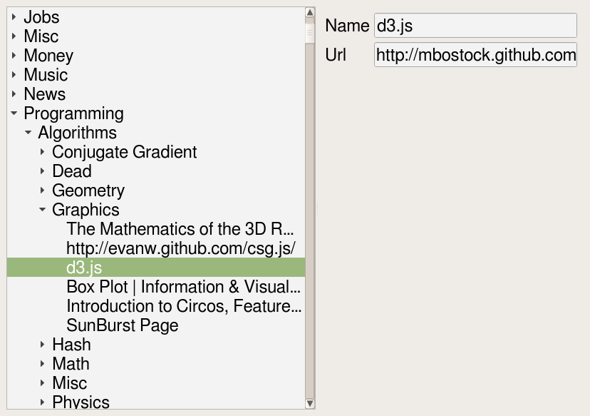

# CBookmarks #
Dump or merge bookmarks HTML files

## ToDo ##
 + process multiple files (and merge)
 + locate duplicates
 + Create Group and Add Name/Addr to Group (if not exist)
 + Optional soft per group and groups (Groups first)
 + Create extra group to catch all extras
 + gui interface

# CBookmarksLib #
Read bookmarks HTML file into internal structure

# CQBookmarks #
Qt interface to view bookmarks

## ToDo ##
 + highlight duplicate items.
 + Allow remove duplcates.
 + Allow reorder, sort, ...
 + Allow save
